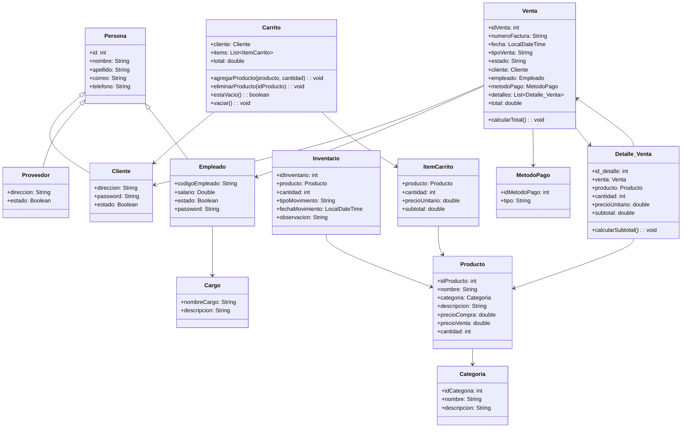

# Proyecto Integrador - Programación II

## Descripción

Sistema de gestión de ventas e inventario desarrollado en Java con patrón MVC (Modelo-Vista-Controlador).

## Diagrama UML



## Estructura del Proyecto

```
src/
├── main/
│   └── java/
│       └── Proyecto/
│           ├── Controlador/
│           │   └── Controlador.java
│           ├── Modelo/
│           │   ├── Almacenista.java
│           │   ├── Carrito.java
│           │   ├── Cliente.java
│           │   ├── Detalle_Venta.java
│           │   ├── Inventario.java
│           │   ├── Persona.java
│           │   ├── Producto.java
│           │   ├── Reporte.java
│           │   ├── Usuario.java
│           │   └── Venta.java
│           ├── Vista/
│           │   └── Vista.java
│           └── Main.java
├── pom.xml
└── README.md
```

## Tecnologías Utilizadas

- Java
- Maven
- Patrón MVC

## Autor

Juanes
