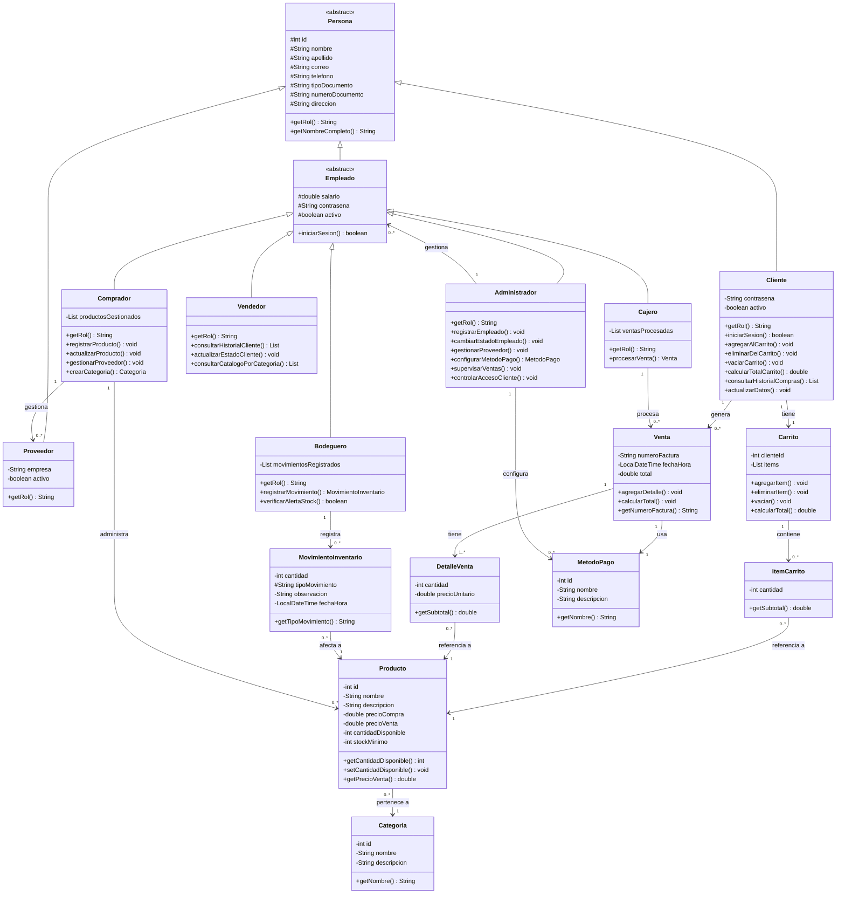

# Proyecto Integrador - Programación II

## Descripción

Sistema de gestión de ventas e inventario desarrollado en Java con patrón MVC (Modelo-Vista-Controlador).

## Diagrama UML

```mermaid
classDiagram

    %% ══ CLASES ABSTRACTAS ══
    class Persona {
        <<abstract>>
        #int id
        #String nombre
        #String apellido
        #String correo
        #String telefono
        #String tipoDocumento
        #String numeroDocumento
        #String direccion
        +getRol() String
        +getNombreCompleto() String
    }

    class Empleado {
        <<abstract>>
        #double salario
        #String contrasena
        #boolean activo
        +iniciarSesion() boolean
    }

    %% ══ HIJOS DE PERSONA ══
    class Cliente {
        -String contrasena
        -boolean activo
        +getRol() String
        +iniciarSesion() boolean
        +agregarAlCarrito() void
        +eliminarDelCarrito() void
        +vaciarCarrito() void
        +calcularTotalCarrito() double
        +consultarHistorialCompras() List
        +actualizarDatos() void
    }

    class Proveedor {
        -String empresa
        -boolean activo
        +getRol() String
    }

    %% ══ HIJOS DE EMPLEADO ══
    class Cajero {
        -List ventasProcesadas
        +getRol() String
        +procesarVenta() Venta
    }

    class Vendedor {
        +getRol() String
        +consultarHistorialCliente() List
        +actualizarEstadoCliente() void
        +consultarCatalogoPorCategoria() List
    }

    class Bodeguero {
        -List movimientosRegistrados
        +getRol() String
        +registrarMovimiento() MovimientoInventario
        +verificarAlertaStock() boolean
    }

    class Comprador {
        -List productosGestionados
        +getRol() String
        +registrarProducto() void
        +actualizarProducto() void
        +gestionarProveedor() void
        +crearCategoria() Categoria
    }

    class Administrador {
        +getRol() String
        +registrarEmpleado() void
        +cambiarEstadoEmpleado() void
        +gestionarProveedor() void
        +configurarMetodoPago() MetodoPago
        +supervisarVentas() void
        +controlarAccesoCliente() void
    }

    %% ══ CLASES DE NEGOCIO ══
    class Producto {
        -int id
        -String nombre
        -String descripcion
        -double precioCompra
        -double precioVenta
        -int cantidadDisponible
        -int stockMinimo
        +getCantidadDisponible() int
        +setCantidadDisponible() void
        +getPrecioVenta() double
    }

    class Categoria {
        -int id
        -String nombre
        -String descripcion
        +getNombre() String
    }

    class Carrito {
        -int clienteId
        -List items
        +agregarItem() void
        +eliminarItem() void
        +vaciar() void
        +calcularTotal() double
    }

    class ItemCarrito {
        -int cantidad
        +getSubtotal() double
    }

    class Venta {
        -String numeroFactura
        -LocalDateTime fechaHora
        -double total
        +agregarDetalle() void
        +calcularTotal() void
        +getNumeroFactura() String
    }

    class DetalleVenta {
        -int cantidad
        -double precioUnitario
        +getSubtotal() double
    }

    class MovimientoInventario {
        -int cantidad
        #String tipoMovimiento
        -String observacion
        -LocalDateTime fechaHora
        +getTipoMovimiento() String
    }

    class MetodoPago {
        -int id
        -String nombre
        -String descripcion
        +getNombre() String
    }

    %% ══ HERENCIAS ══
    Persona <|-- Cliente
    Persona <|-- Proveedor
    Persona <|-- Empleado
    Empleado <|-- Cajero
    Empleado <|-- Vendedor
    Empleado <|-- Bodeguero
    Empleado <|-- Comprador
    Empleado <|-- Administrador

    %% ══ ASOCIACIONES CON CARDINALIDADES ══
    Cliente        "1" --> "1"    Carrito              : tiene
    Carrito        "1" --> "0..*" ItemCarrito          : contiene
    ItemCarrito    "0..*" --> "1" Producto             : referencia a
    Producto       "0..*" --> "1" Categoria            : pertenece a

    Cliente        "1" --> "0..*" Venta                : genera
    Cajero         "1" --> "0..*" Venta                : procesa
    Venta          "1" --> "1"    MetodoPago           : usa
    Venta          "1" --> "1..*" DetalleVenta         : tiene
    DetalleVenta   "0..*" --> "1" Producto             : referencia a

    Bodeguero      "1" --> "0..*" MovimientoInventario : registra
    MovimientoInventario "0..*" --> "1" Producto       : afecta a

    Administrador  "1" --> "0..*" Empleado             : gestiona
    Administrador  "1" --> "0..*" MetodoPago           : configura
    Comprador      "1" --> "0..*" Proveedor            : gestiona
    Comprador      "1" --> "0..*" Producto             : administra
```
