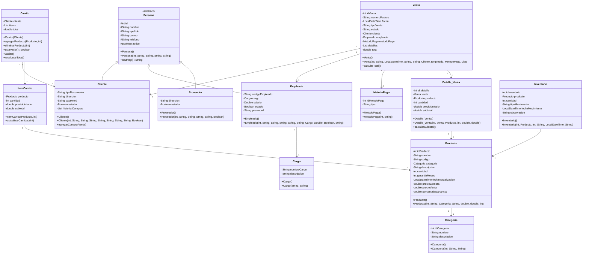

# Proyecto Integrador - Programación II

## Descripción

Sistema de gestión de ventas e inventario desarrollado en Java con patrón MVC (Modelo-Vista-Controlador).

## Diagrama UML



## Estructura del Proyecto

```
proyecto-integrador-pii/
├── src/
│   ├── main/
│   │   ├── java/
│   │   │   └── Proyecto/
│   │   │       ├── Main.java
│   │   │       ├── Controlador/
│   │   │       │   └── Controlador.java
│   │   │       ├── Modelo/
│   │   │       │   ├── Cargo.java
│   │   │       │   ├── Carrito.java
│   │   │       │   ├── Categoria.java
│   │   │       │   ├── Cliente.java
│   │   │       │   ├── Detalle_Venta.java
│   │   │       │   ├── Empleado.java
│   │   │       │   ├── Inventario.java
│   │   │       │   ├── ItemCarrito.java
│   │   │       │   ├── MetodoPago.java
│   │   │       │   ├── Persona.java
│   │   │       │   ├── Producto.java
│   │   │       │   ├── Proveedor.java
│   │   │       │   └── Venta.java
│   │   │       └── Vista/
│   │   │           └── Vista.java
│   │   └── resources/
│   └── test/
│       └── java/
├── target/
├── pom.xml
└── README.md
```

## Tecnologías Utilizadas

- Java
- Maven
- Patrón MVC

## Autor

Juanes
